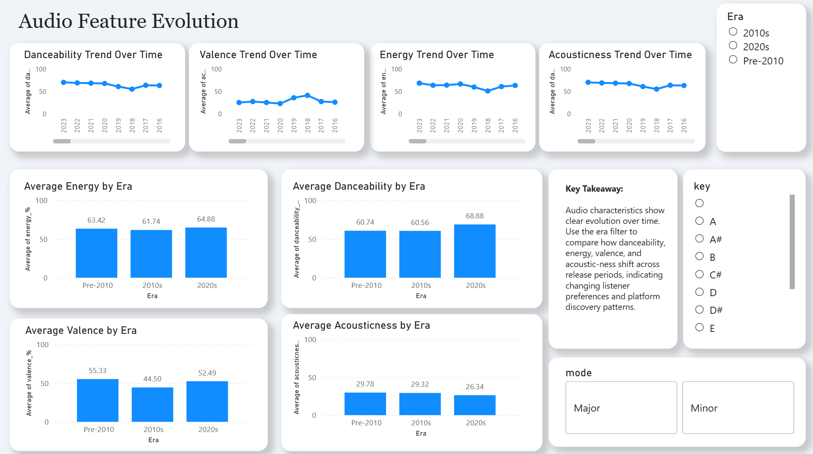

# Spotify Song Virality & Audio Feature Analysis (Power BI)

## Introduction
This project analyses historical Spotify song data to understand **how song virality has evolved over time**.  
The goal is to identify patterns in release timing, era-level performance, and audio characteristics that influence how songs gain attention on streaming platforms.

The dashboard focuses on three core questions:
- Does **when** a song is released affect its viral potential?
- How has **average virality changed across eras** despite increasing music output?
- How has the **sound of viral music evolved** over time?

By combining custom metrics, interactive visuals, and clear storytelling, this project demonstrates an end-to-end Business Intelligence workflow.

---

## Business Questions Answered
- Are certain **months or years** more likely to produce viral songs?
- How does song virality differ between **Pre-2010, 2010s, and 2020s**?
- Has the surge in music releases during the 2020s reduced **average song impact**?
- How have **audio features** such as danceability, energy, valence, and acousticness changed over time?
- Which artists dominate in terms of **reach versus average virality**?

---

## Dashboard Overview

### Release Timing & Virality Trends
This section examines how virality changes over time and across release months.

**Key elements:**
- KPI cards showing Average Viral Index, Years Covered, Total Streams (Billions), and Number of Songs
- Line chart visualising long-term virality trends
- Month-level seasonality analysis
- Year × Month heatmap highlighting peak viral periods

**Insight:**  
Song virality fluctuates significantly across years and months, suggesting that release timing plays a meaningful role in discovery and performance.

---

### Era Analysis (Pre-2010 vs 2010s vs 2020s)
This section compares song volume and average impact across different musical eras.

**Key elements:**
- Era-level KPIs showing distribution of song releases
- Average Viral Index comparison across eras
- Scatter plot (Volume vs Impact) illustrating trade-offs between release volume and attention
- Artist dominance table combining total streams and average virality

**Key Finding:**  
Songs released in the **2020s show lower average virality** compared to the 2010s, despite a substantially higher volume of releases. This suggests increased competition for listener attention and shorter content lifecycles in the streaming era.

---

### Audio Feature Evolution
This section explores how the **sound of viral music** has evolved over time.

**Key elements:**
- Trend analysis of:
  - Danceability
  - Energy
  - Valence
  - Acousticness
- Era-based comparison charts
- Interactive slicers for Era, Musical Mode, and Key

**Insight:**  
Modern viral songs tend to be more **danceable and energetic**, with declining acousticness, reflecting shifting listener preferences and platform-driven discovery mechanisms.

---

## Custom Metrics
- **Viral Index**: A custom DAX measure combining streaming volume, playlist presence, and chart performance
- Average Viral Index is used consistently across visuals to enable fair comparison across time and eras

---

## Tools & Techniques
- **Power BI**
- DAX (custom measures and aggregations)
- Conditional formatting (heatmaps)
- Interactive slicers and drill-through
- Data modelling and visual storytelling

---

## Dataset
- Public Spotify dataset sourced from Kaggle  
- Includes song metadata, audio features, chart presence, and streaming metrics

---

## Why This Project Matters (For Recruiters)
✔ Demonstrates full BI workflow from raw data to insights  
✔ Shows strong data storytelling and business framing  
✔ Uses advanced visuals without unnecessary complexity  
✔ Highlights analytical thinking beyond basic dashboards  

---

## Conclusion
The analysis reveals a clear shift in the dynamics of song virality. While the 2020s have seen a dramatic increase in music output, average song virality has declined compared to the 2010s.

This indicates heightened competition for attention and shorter content lifecycles in the modern streaming environment. At the same time, audio characteristics have evolved — modern viral songs are generally more energetic and danceable, with reduced acoustic influence.

Overall, success on streaming platforms appears to be driven not by volume alone, but by strategic release timing, sound design, and platform discovery dynamics.

---

## Dashboard Preview

### Release Timing & Virality Trends

### Era Analysis: 2010s vs 2020s
.png)

### Audio Feature Evolution

---

## Author
Created by **Varun Sridhar**  
Aspiring Data Analyst / BI Analyst

